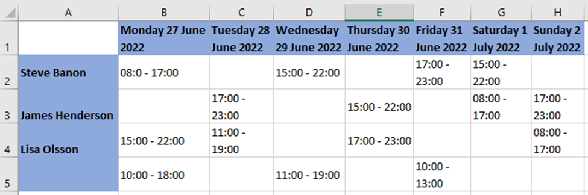

## Recomendations
As recomendation, I can suggest to the technical team that they consider incorporating an ORM like Entity Framework for the use of SQL Lite, which would enable them to focus on a Code First approach to the solution. Additionally, as an advantage, this would allow all the queries, currently represented as strings, to be in code format and updated in the repository.

# Scheduling API Code Challenge

Welcome to the Scheduling API Code Challenge. This challenge will help us understand your approach as a software developer. It is divided into four tasks of increasing complexity. You are not required to complete all tasks, but please complete as many as you can. The challenge centers around a Scheduling API that allows you to manage employee shifts.

To provide a visual representation and explain the concepts, here is a mockup of the UI that this backend should support:



For example, you can see that employee **Steve Banon** is assigned to a shift on **Monday, June 27, 2022**, from **08:00 AM to 05:00 PM**, and the same for **James Henderson** on **Thursday, June 30, 2022**, from **03:00 PM to 10:00 PM**.

There are also open shifts, which are shifts without an assigned employee. You can see an open shift on **Wednesday, June 29, 2022**, from **11:00 AM to 07:00 PM**.

## Task 1: Query a Shift

In this task, you need to add an endpoint and the necessary services to the solution in the `ShiftController` that returns a shift based on its ID.

**Acceptance criteria:**

- Implemented an endpoint that returns a shift.
- The endpoint requires a Shift ID as input.

```markdown
Task 1: Query a Shift 

- Implemented an endpoint that returns a shift.
- The endpoint requires a Shift ID as input.
```

## Task 2: Create an Open Shift

For Task 2, add an endpoint and the necessary services to create an open shift. An open shift is a shift without an employee assigned to it.

# Important clarification

The database was updated with an default employee. To be able to set the default EmployeeId for open shifts as -1. All validations are now handled in the controller, not as part of the database constraints.

**Acceptance criteria:**

- The endpoint creates a shift without an employee assigned to it.
- The endpoint requires a shift model as input.
- The start time must not be greater than the end time.
- Start and end time should be on the same day.

```markdown
Task 2: Create an Open Shift

- Implemented an endpoint that creates an open shift (shift without an employee assigned).
- The endpoint requires a shift model as input.
- Enforces that the start time is not greater than the end time.
- Ensures that the start and end time are on the same day.
```

## Task 3: Assign a Shift to an Employee

Task 3 involves adding an endpoint and the necessary services to assign a shift to an employee.

**Acceptance criteria:**

- The endpoint requires the Shift ID and the Employee ID.
- Validates the existence of both the employee and the shift.
- Ensures that the employee does not have overlapping shifts, meaning they cannot be assigned to a shift when they are already working.
- Prevents the assignment of the same shift to two or more employees.

```markdown
Task 3: Assign a Shift to an Employee

- Implemented an endpoint that assigns a shift to an employee.
- The endpoint requires the Shift ID and the Employee ID.
- Validates the existence of both the employee and the shift.
- Ensures that the employee does not have overlapping shifts.
- Prevents the assignment of the same shift to multiple employees.
```

## Task 4: Create an API Client to Fetch Employee Information

Task 4 involves creating an API client to fetch employee information from an external API located at `http://planday-employee-api-techtest.westeurope.azurecontainer.io:5000/`. The API has only one endpoint that returns employee information by ID. You need to authenticate the call using the provided key.

**Acceptance criteria:**

- The "Get Shift by ID" endpoint must also retrieve the email of the employee from the external API.
- Do not save the employee's email when assigning the shift; retrieve it from the external API when requesting shift information.

```markdown
Task 4: Create an API Client to Fetch Employee Information

- Created an API client to fetch employee information from an external API.
- The "Get Shift by ID" endpoint retrieves the email of the employee from the external API.
- Employee email is not saved during shift assignment; it's fetched on demand from the external API.
```

## Additional Notes

- **About SQL:**
  - Utilize the SQLite database provided, which contains tables with shift and employee data.
  - We also provided an SQL script (`dbtables.sql`) that defines the tables and initial data.
  - You can interact with the database using the SQLite CLI.
  
```shell
./sqlite3 planday-schedule.db
SELECT * FROM Shift;
1|1|2022-06-17 12:00:00.000|2022-06-17 17:00:00.000
2|2|2022-06-17 09:00:00.000|2022-06-17 15:00:00.000
SELECT * FROM Employee;
1|John Doe
2|Jane Doe
```

- Aim to spend no more than 4 hours on this assignment, although you can invest more time if you choose.
- Make design decisions as necessary.
- Test coverage is highly valued.
- Performance improvement ideas are welcome but not mandatory for this challenge.
